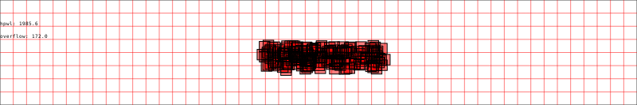

# AIEplace
Implementation of the [RePlace](https://github.com/The-OpenROAD-Project/RePlAce) algorithm on the AMD Versal architecture, utilizing AIE, PL, and PS regions of the chip.

# TODO
* Python: Add convergence detection (e.g. < 10% change)
* Find and test AIE array benchmarks
* Collect data on hyperparameters
* Explore using Sparse Matrices for HPWL computation
* 10min Progress presentation

# References

[1] Lu, Jingwei, et al. "ePlace: Electrostatics-based placement using fast fourier transform and Nesterov's method." ACM Transactions on Design Automation of Electronic Systems (TODAES) 20.2 (2015): 1-34.

[2] Cheng, Chung-Kuan, et al. "Replace: Advancing solution quality and routability validation in global placement." IEEE Transactions on Computer-Aided Design of Integrated Circuits and Systems 38.9 (2018): 1717-1730.

[3] Lin, Yibo, et al. "Dreamplace: Deep learning toolkit-enabled gpu acceleration for modern vlsi placement." IEEE Transactions on Computer-Aided Design of Integrated Circuits and Systems 40.4 (2020): 748-761.
