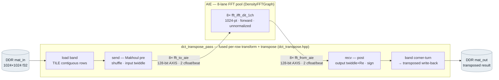

# dct_fft_aie — DCT-transpose ↔ AIE-FFT integration test (VCK5000)

A self-contained test that exercises the PL `dct_transpose` module streaming rows into the 8-lane AIE forward-FFT pool and
reading them back. Both halves are already verified in isolation — the FFT is a Xilinx DSPLib
kernel, and `dct_transpose` is proven numerically against a double golden in software — so what
this checks is their **integration under real hardware timing**: stream wiring, beat packing,
lane ordering, and graph-iteration sync.

Nothing here depends on the AIEplace tree; the verified headers are copied in. Hand the whole
folder to whoever runs the card.

There is **one** data path — a single round-trip. A row leaves the PL, gets FFT'd on the AIE,
and comes straight back to the PL; the loop just happens to cross the PL↔AIE boundary twice
(the two labelled AXIS hops). Nothing forks.



The whole datapath is one function, `dct_transpose_pass`, which **fuses** the per-row transform
with the transpose: it loads a band of rows, streams them (Makhoul-shuffled) to the AIE FFT, reads
them back and applies the twiddle/real-part post-step, then writes the band out transposed. The
`top` kernel is just the thin `extern "C"` wrapper that gives it DDR and AXIS ports — not drawn.

The AIE does **only** the forward complex FFT. All DCT / IDCT / IDXST pre- and post-processing
(Makhoul shuffle, twiddle, real-part, sign-flip) runs on the PL inside `dct_transpose_pass`.
`xform` selects which of the three transforms the pass computes.

## What it verifies

One device pass computes `mat_out = transpose( transform_rows(mat_in) )`. The host recomputes
that in **double precision** (`src/host/golden.hpp`) and asserts the device output matches at
`rel_rms < 1e-3`. The AIE FFT is single-precision `cfloat`, so the bar is a hardware tolerance,
not the ~1e-8 the software model reaches — a genuine integration failure (mis-wired lane,
dropped/duplicated beat, pack/endian error, graph-iteration mismatch) shows up as an order-1 or
structural error, far above the bar. The host **asserts and exits non-zero on failure**; it does
not print a number for a human to judge.

## Layout

| path | what |
|------|------|
| `src/aie/graph.cpp`, `DensityFFTGraph.h` | 8-lane forward-FFT pool (verbatim from pl_algo) |
| `src/pl/top.cpp` | minimal kernel: **only** `dct_transpose_pass` + 2 DDR bundles + 16 AXIS streams |
| `src/pl/modules/dct_transpose.hpp` | the fused pass — the module under test (Makhoul helpers inlined) |
| `src/pl/{formats,host_interface}.hpp` | the byte-layout contract, verbatim from pl_algo |
| `src/host/host.cpp`, `golden.hpp` | XRT driver + double-precision reference |
| `test/golden_test.cpp` | pure-g++ self-check of the golden (no Vitis) |
| `link.cfg` | wires the 16 PL streams ↔ 8 AIE PLIO ports |
| `Makefile`, `run_hw.sh` | 3-step Versal build; Geert's run wrapper |

## Build & run

Source the tools first:
```bash
source /tools/Xilinx/Vitis/2022.2/settings64.sh
source /opt/xilinx/xrt/setup.sh
```

Then, cheapest-first (each step gates the next):

```bash
make golden                # 1. double golden self-check — pure g++, seconds, no Vitis
make csynth                # 2. v++ -c of the PL top — confirms it synthesizes (minutes)
make TARGET=sw_emu run      # 3. full build + x86-AIE-model emulation on a dev box
make TARGET=hw  all         # 4. build the real-silicon xclbin  →  hand to the card
./run_hw.sh dct             #    run on the real VCK5000  (also: idct, idxst)
```

Expected on success: `TEST PASSED  transform=dct  rel_rms=<small> (tol 1.0e-03)`.

> **Note (this platform):** only `sw_emu` emulation is viable for AIE designs on the VCK5000
> QDMA platform — `hw_emu` lacks `xclGraphOpen` graph control. Verify in `sw_emu`, then build
> `TARGET=hw` for the real card.

## Test coverage

`dct` is the primary case. `idct` and `idxst` run the **same fused kernel and the same single
forward-FFT pool** — only the PL send/recv pre/post differ — so once `dct` passes on hardware,
running all three confirms the mode switch holds. All three share the one AIE graph.
