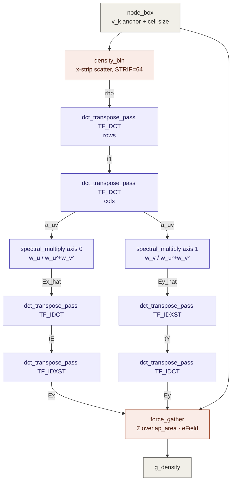

# pl_algo block diagram — the density branch

Expansion of the one collapsed box in [[DIAGRAM_iteration.md]]. Authoritative contract is
[[DATAFLOW.md]]; this file is the picture.

The branch is the ePlace electrostatic solve: scatter cell areas into a charge density `rho`,
solve Poisson spectrally for the field, gather the field back onto cells as a force.

## 1. Matrix chain — eight passes over DDR

Every matrix is 1024×1024 float = 4 MB, so all of them are DDR-resident and streamed in row
tiles. The host ping-pongs gmem10/gmem11 (`dct_in`/`dct_out`) across the eight passes;
`Driver.cpp:1025-1032` is the call sequence.

**Why two forward passes and not one.** `dct_transpose_pass` transposes as it writes, so two
passes restore the original orientation while transforming both axes. Same for each inverse
field: `Ex = IDXST_x(IDCT_y(Ex_hat))`, `Ey = IDCT_x(IDXST_y(Ey_hat))` — note the axes are
swapped between Ex and Ey, which is easy to get backwards.

**`node_footprint` is a shared helper, not a block.** `density_bin` scatters area *into* rho;
`force_gather` gathers `area · eField` *out*. They are exact adjoints, so both must use
identical geometry — the √2-bin clamp with `weight = real_area / clamped_area`. One helper,
called from both, is what enforces that.

**`density_bin` is two-pass per strip**, mirroring sw_only `computeOverlaps`: fixed nodes
first, clamp every bin to `target_density · bin_area`, then movable nodes on top. So overflow
only appears where a movable cell sits on a fixed one. Fillers are excluded in v1.

## 2. Inside one transform pass — the only AIE crossing

```mermaid
flowchart LR
    din["matrix in<br/>DDR"]
    load["dct_load_rows<br/>8 rows, 512-bit burst"]
    send["xform_send_lane ×8<br/>shuffle / twiddle / reverse"]
    aie["AIE FFT pool<br/>8 × forward 1024-pt FFT"]
    recv["xform_recv_lane ×8<br/>twiddle+Re / unshuffle / sign flip"]
    band["band buffer<br/>TILE × GRID corner turn"]
    wb["dct_writeback_band<br/>transposed stripe"]
    dout["matrix out<br/>DDR, transposed"]

    din --> load --> send
    send -->|"AXIS 128b ×8"| aie
    aie -->|"AXIS 128b ×8"| recv
    recv --> band --> wb --> dout

    classDef xf fill:#EEEDFE,stroke:#534AB7,color:#26215C
    classDef ai fill:#FAEEDA,stroke:#854F0B,color:#412402
    classDef nt fill:#F1EFE8,stroke:#5F5E5A,color:#2C2C2A

    class load,send,recv,band,wb xf
    class aie ai
    class din,dout nt
```

**This is the entire AIE boundary of pl_algo.** The AIE runs one config — an unnormalized
forward FFT — and nothing else. The transform_mode FSM, the Makhoul shuffle, the twiddle ROM,
the unshuffle permutation and the IDXST odd-output sign flip all live in PL
(`xform_send_lane` / `xform_recv_lane`). `TF_DCT`, `TF_IDCT` and `TF_IDXST` share this one
kernel and this one FFT pool; only the PL pre/post switches.

The 8 lanes are interleaved at beat level — one pipelined `send` loop writes a beat to each of
the 8 streams per cycle, then one `recv` loop drains a beat from each — so the 8 FFT instances
fill and compute in parallel, batch cost ≈ 1× send + 1× recv, not 8×. Within a lane `send`
must precede `recv` because the window-API FFT buffers a whole frame; the overlap is *across*
lanes.

The band buffer is what fuses the transpose in. Reading a 32×32 tile from DDR is 32 separate
short bursts, which stalled at II=32 on the single AR channel. A band of TILE *full* rows is
contiguous — one burst, latency paid once per band. Details in `transpose.hpp`.

## PL-only alternate

`field_solve_pl.hpp` + `fft_pl.hpp` implement the entire chain above with no AIE at all — FFT,
DCT, IDCT and IDXST in HLS, all grids on-chip. It exists so a `PL_ONLY` build can run the whole
iteration under hw_emu RTL simulation in tractable time, and it only fits at a small grid
(`-DPL_GRID=64`). The 1024 AIE datapath remains the throughput path.
