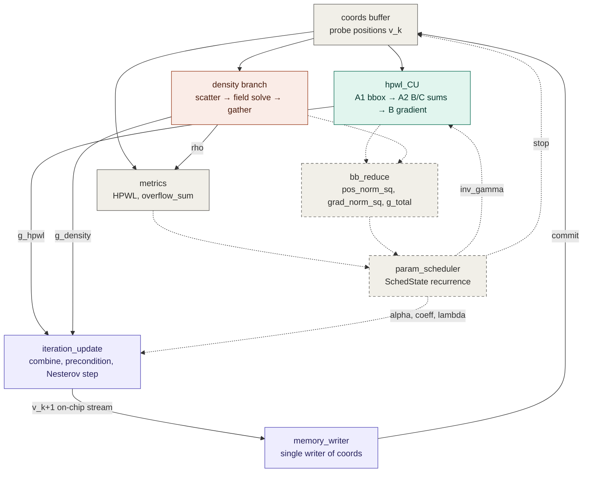

# pl_algo block diagram — one placement iteration

Companion to [[DATAFLOW.md]], which is authoritative for the byte/beat contract. This file is
the picture; when the two disagree, DATAFLOW.md wins. The density branch is expanded in
[[DIAGRAM_density.md]].

**Solid = wired into `top.cpp` today. Dashed = built and verified, not yet wired.**

## Reading the edges

| Edge | Carrier | Note |
|---|---|---|
| coords → hpwl_CU | gmem0 `node_pos`, `coord_t[N]` | pin position = `node_pos[node_idx] + {off_x, off_y}` |
| coords → density branch | gmem8 `node_box` | `node_box.{x,y}` **is** v_k; `{w,h}` is the cell size |
| hpwl_CU → iteration_update | gmem7 `node_grad`, `coord_t[M]` | write-once in node order, so the write bursts |
| density → iteration_update | gmem10 (aliased `dct_in`) | `coord_t[M]` |
| iteration_update → memory_writer | `hls::stream<coord_t>`, depth 64 | the only intra-kernel stream today; DATAFLOW region in `iteration_step_df` |
| metrics → host | gmem11 `dct_out[0..1]` | host scales `overflow_sum` by `bin_area / movable_area` |

`hpwl_CU` also owns two DDR scratch arrays, `bb[num_nets]` and `sums[num_nets]`, that bridge
its phase A to its phase B. They never leave the module, so they are not drawn.

## The dashed half

`bb_reduce` and `param_scheduler` are the device-resident control path. They C-synthesize
(411 MHz, `bb_loop` II=1) and `param_scheduler` replays the sw_only golden trace bit-for-bit,
but nothing calls them — `top.cpp` is still a mode-switch scaffold and the policy lives on the
host in `host/src/pl_algo/src/Placement.hpp`. Composing them is Stage 5.

**Do not compose it next.** See the 2026-08-06 warning in [[DATAFLOW.md]] and TODO #20: the
scheduler is pinned to the 2026-07-14 sw_only and its golden fixture cannot be regenerated
(`dumpScheduleTrace()` was deleted in `44612cc`). Restore the trace and the tier-1 coverage first.

## Per-iteration order once the loop is resident

1. `hpwl_CU(v_k, inv_gamma_k)` → g_hpwl
2. density branch at v_k → g_density
3. `bb_reduce` → pos_norm_sq, grad_norm_sq, and materializes g_total_k
4. `metrics(v_k, rho)` → HPWL, overflow_sum
5. `param_scheduler` → inv_gamma, alpha, coeff, lambda, **stop**
6. `iteration_update` → v_k+1 → `memory_writer`
7. carry v_k-1 ← v_k, g_total_prev ← g_total_k; exit if stop
